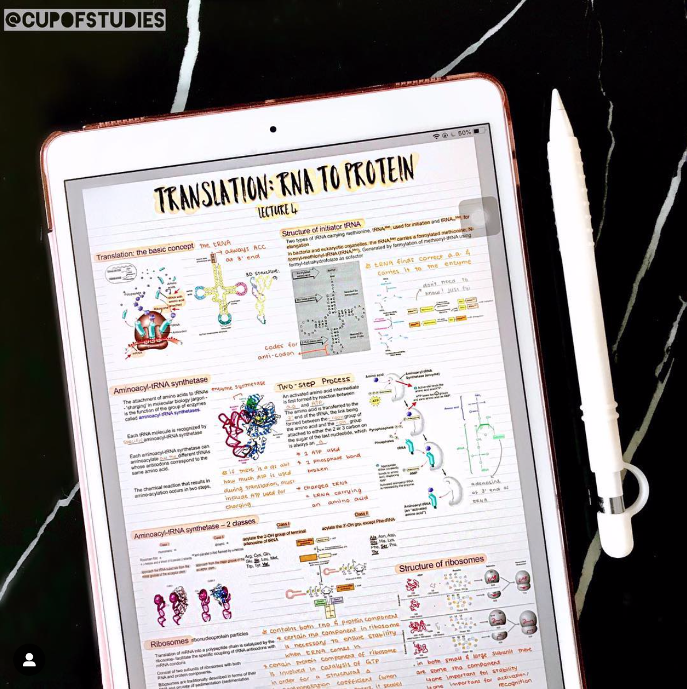

It's a new year, and I'm starting it with a few changes in progress - December ended up being a whirlwind of activity!

The biggest change by far is that I'm leaving [Makers](). I've been coaching for two years now, and it's definitely time for a change. I've got my next job lined up so I'll share more details once I've started, but for now it's enough to know that I'm going back to web development and couldn't be happier :)

I'm also working on a whole host of small changes by re-committing to the habits I want to have in my life.

<!--more-->

It turns out that a lot of the habits I want to work on are connected to learning - turns out there's a lot I want to learn. Here's the list as it currently stands:

## Bulgarian
My partner is Bulgarian so I've been learning the language for a few months. Progress has been slow, but steady. I'm starting to understand and form more complex sentences, and try to spend 15-30 minutes a day learning the language.

## Computer Science
I'm leaving education as a job, but have decided to continue my own education! I've been thinking about doing a second undergrad degree for years, and have finally taken the plunge. I'll be starting a BSc in Computer Science in April. It's fully remote and will take 6 years to complete.

I'm not entirely sure I'll have the time, but I'm hoping that if I can find an hour a day then I'll be able to keep up.

## iPad Lettering
Finally a fun one! I started learning Calligraphy a few years ago but didn't enjoy getting through so much paper. I have an iPad pro and Apple pencil, so this year I want to practice lettering and journalling using the iPad. I'm also hoping to use the iPad for the majority of university notes.

Again, I'm aiming to find a little bit of time every day to practice this skill. Aiming for 15-30 minutes a day. I don't think I'll manage anything quite as impressive as this though...

 
 _Image from the [GoodNotes blog](https://medium.goodnotes.com/how-to-create-good-looking-notes-on-the-ipad-50289cb37d90)_

 As always, habits are about progress and just keeping going. It's important to keep habits realistic, and not give up after missing a day or two. I think it's also really important to not have any expectations about progress or goals. Instead I try to find enjoyment in the practice itself - progress cannot be controlled, but it also cannot be avoided with daily practice.
